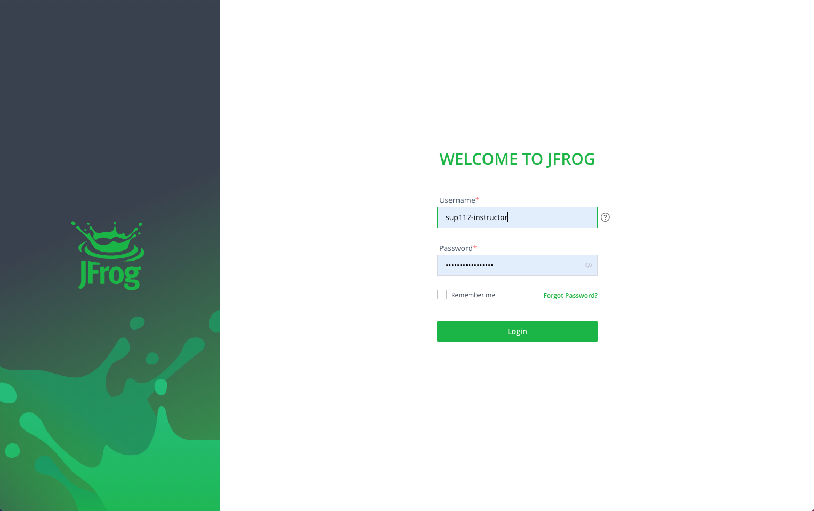
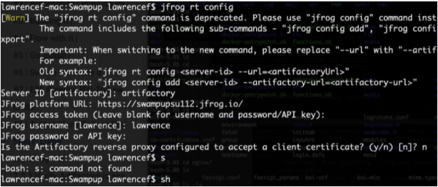
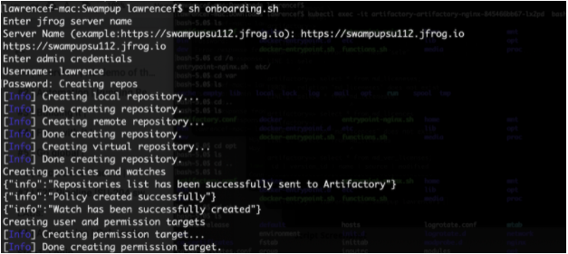

### Lab 1 | Automation


#### Lab description: 

In this lab you will gain experience with one of the most common automation processes for on-boarding a new project to the JFrog Platform. This lab specifically is based on REST API calls.


#### Lab goals:

Hands-on experience with the available JFrog automation tools.


#### How to:

Onboard a new project/team to the platform by creating the required set of resources (repositories: docker,helm, Xray watches and Policies, user/permission) with the required set of permissions for both main JPD and Edge(s)


#### Step1: Login

Login to your saas instance .jfrog.io with your admin credentials




#### Step2: Get familiarity with the JFrog automation tools


##### 2.1 Rest API ping 

Ping the environment using the ping API call

References: [System Health Ping](https://www.jfrog.com/confluence/display/JFROG/Artifactory+REST+API#ArtifactoryRESTAPI-SystemHealthPing)


##### 2.2 JFrog CLI

2.2.1 Download the JFrog CLI

References: [INSTALL JFROG CLI](https://jfrog.com/getcli/)**, **[JFrog CLI](https://www.jfrog.com/confluence/display/CLI/JFrog+CLI)


##### 	2.2.2  Add and configure your SaaS instance with the JFrog CLI \
References: [Adding and Editing Configured Servers](https://www.jfrog.com/confluence/display/CLI/JFrog+CLI#JFrogCLI-JFrogPlatformConfiguration)

##### 2.2.3 Verify Artifactory is accessible

References: [Verifying Artifactory is Accessible](https://www.jfrog.com/confluence/display/CLI/CLI+for+JFrog+Artifactory#CLIforJFrogArtifactory-VerifyingArtifactoryisAccessible)



######  Configure CLI screenshot


#### Step3: Provision the set of resources for the Acme project


##### 3.1 Pre-script (optional)

Check which resources are already available in your environment before running the script that provisiones all resources (Repositories, Xray Policies and Watches and Permission Targets) for the new project.


   [Get Repositories](https://www.jfrog.com/confluence/display/JFROG/Artifactory+REST+API#ArtifactoryRESTAPI-GetRepositories) 


   [Get Permission Targets](https://www.jfrog.com/confluence/display/JFROG/Artifactory+REST+API#ArtifactoryRESTAPI-GetPermissionTargets)


   [Get Watches](https://www.jfrog.com/confluence/display/JFROG/Xray+REST+API#XrayRESTAPI-GetWatches)


   [Get Policies](https://www.jfrog.com/confluence/display/JFROG/Xray+REST+API#XrayRESTAPI-GetPolicies.1)


##### 
3.2 Run the onboarding.sh script



###### Script Screenshot


##### 3.3 Post-script (optional)

Validate the script completed successfully by checking that all the resources for the Acme project are available and ready to be used.


   [Get Repositories](https://www.jfrog.com/confluence/display/JFROG/Artifactory+REST+API#ArtifactoryRESTAPI-GetRepositories) 


   [Get Permission Targets](https://www.jfrog.com/confluence/display/JFROG/Artifactory+REST+API#ArtifactoryRESTAPI-GetPermissionTargets)


   [Get Watches](https://www.jfrog.com/confluence/display/JFROG/Xray+REST+API#XrayRESTAPI-GetWatches)


   [Get Policies](https://www.jfrog.com/confluence/display/JFROG/Xray+REST+API#XrayRESTAPI-GetPolicies.1)


#### Step4: Populate some content on your new repositories using the JFrog CLI

For simplicity we’ll copy a docker image and a helm chart that are already available in our environment.


```
$ jfrog rt cp su112-docker-dev-local/nginx/ acme-docker-dev-local/nginx/
$ jfrog rt cp su112-helm-local/nginx/ acme-helm-dev-local/nginx/
