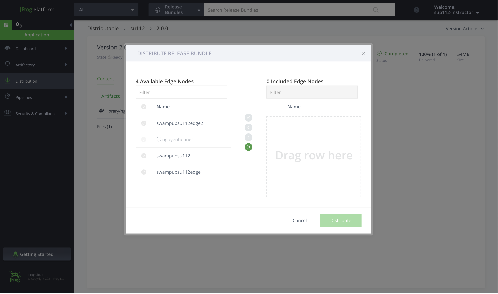
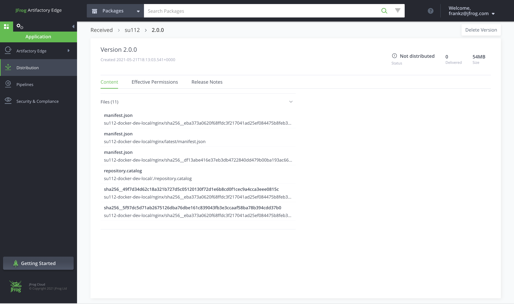

### Lab 2 | Distribution

#### Lab goals: Gain Hand-on experience with JFrog Distribution by managing full Release Bundle lifecycle

#### Step1: Login and navigate to JFrog Distribution

Now that you’re familiar with your environment, login to your main JPD using your admin credentials and then navigate Distribution service in the Application panel.

#### Step2: Manage Release Bundle Lifecycle (Create, Sign and Distribute)

2.1 Create a new Release Bundle

  2.1.1 Click + New Release Bundle
 
  2.1.2 Give your Release Bundle a convenient name, version and description
 
  2.1.3 Click the Create Query. For simplicity, use the first option - Add Query. Give this query a name and for the Search Criteria choose Acme docker local repository. Click Next.
 

  2.1.4 Additional Details - here you can the queried artifacts with properties and also change the repository path mapping. we’ll skip this option by clicking Next.

  2.1.5 Preview Artifacts - here is the list of all artifacts that answered this query wizard. Because the only search criteria we used is the repository name in this view we’re getting all artifacts in this repository.

  2.1.6 Repeat steps 2.1.3-2.15 but now query Acme helm repository.

2.2 Sign the created Release Bundle

   2.2.1 Try and edit this Release Bundle. 

*   Click on your new release bundle, now you can see all its available versions and each version state. As you can see its state is Ready and there is a lock next to it - this means it’s immutable and can’t be edited. 
*   Let’s try anyway - click on the RB version then click the Version Actions (right on the top) as you can see the Edit Version action is greyed out.

   2.3 Distribute the Release Bundle to the available Edge Node in your federation

*   Click again on the Version Actions and choose the Distribute Version
*   Choose the Edge JPD and click Distribute

#### Step3: Consume the distributed Release Bundle

3.1 Login to your Edge 

3.2 Navigate to the Application panel | Distribution section and there you get your distributed Release Bundle.

##### References:

[Distributing Release Bundles](https://www.jfrog.com/confluence/display/JFROG/Distributing+Release+Bundles)
