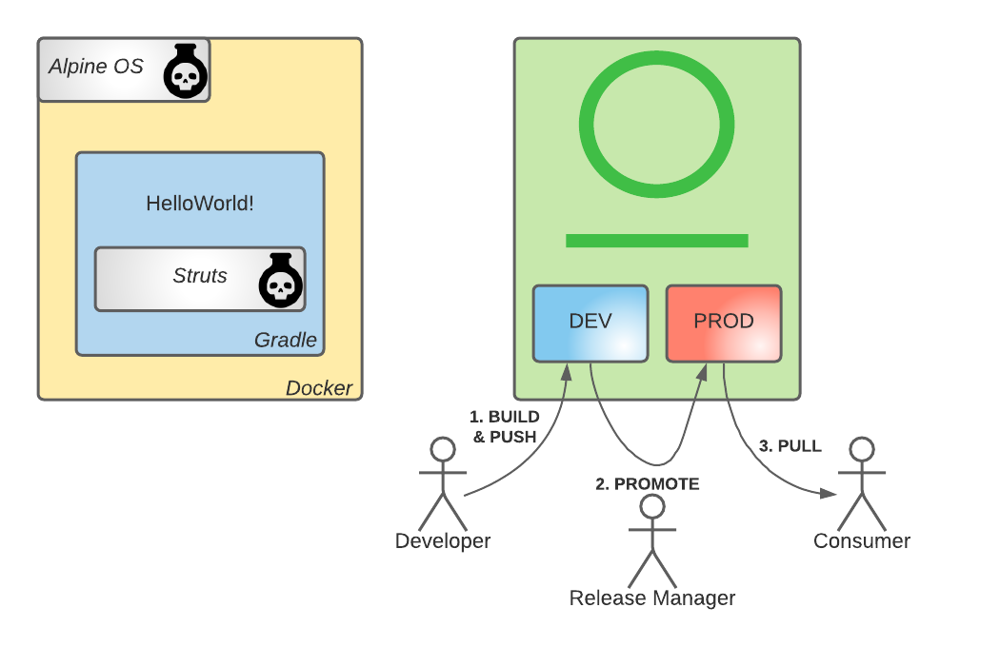

# Lab 1

## Context

- You are developing a new software and security is not a concern

## Objective



- Create a Gradle project and ship the archive in a Docker image
- Upload the artifacts to Artifactory
- Promote the Docker image to a production grade repository
- Download the Docker image

struts library and alpine base image have several CVEs.
A critical vulnerability is present on both allowing remote code execution.

## Share the environment

```bash
printf "Artifactory: ${ARTIFACTORY_URL}\nGradle repo: ${GRADLE_REPO_DEV}\nDocker Repo: ${DOCKER_REGISTRY_DEV}\n" 
```

## Build the gradle project

```bash
printf "Building ${PROJECT_VERSION_LAB1}\nwith struts ${STRUTS_VERSION_UNSAFE} (unsafe)\n" 
```

```bash
gradle clean artifactoryPublish \
    -PprojectVersion="${PROJECT_VERSION_LAB1}" \
    -PartifactoryUrl="${ARTIFACTORY_URL}" \
    -PartifactoryGradleRepo=${GRADLE_REPO_DEV} \
    -PartifactoryUser="${ARTIFACTORY_LOGIN}" \
    -PartifactoryApiKey="${ARTIFACTORY_API_KEY}" \
    -PstrutsVersion="${STRUTS_VERSION_UNSAFE}"
```

## Log into Docker registry

```bash
docker login -u "${ARTIFACTORY_LOGIN}" -p "${ARTIFACTORY_API_KEY}" "${DOCKER_REGISTRY_DEV}"
```

## Build Docker image

```bash
printf "Building ${IMAGE_ABSOLUTE_NAME_DEV_LAB1}\nwith base image ${BASE_IMAGE_UNSAFE} (unsafe)\n" 
```

```bash
docker build -t "${IMAGE_ABSOLUTE_NAME_DEV_LAB1}" --build-arg "BASE_IMAGE=${BASE_IMAGE_UNSAFE}" .
```

## Push Docker image to Artifactory

```bash
docker push "${IMAGE_ABSOLUTE_NAME_DEV_LAB1}"
```

## Promote Docker image to production repository

```bash
curl -u "${ARTIFACTORY_LOGIN}:${ARTIFACTORY_API_KEY}" \
     -H 'Content-Type: application/json' \
     -X POST "${ARTIFACTORY_URL}/api/docker/${DOCKER_REPO_DEV}-local/v2/promote" \
     -d "{\"targetRepo\":\"${DOCKER_REPO_PROD}-local\",\"dockerRepository\":\"${IMAGE_NAME}\"}"
```

## Download image

Remove local images:
```bash
docker rmi "${IMAGE_ABSOLUTE_NAME_DEV_LAB1}" 2>/dev/null
docker rmi "${BASE_IMAGE_UNSAFE}" 2>/dev/null
```

Check local docker image:
```bash
docker images | grep "${DOCKER_REPO_PROD}"
```

Pull docker image:
```bash
docker pull "${IMAGE_ABSOLUTE_NAME_PROD_LAB1}"
```

Check local docker image:
```bash
docker images | grep "${DOCKER_REPO_PROD}"
```

## Conclusion

Image can be downloaded successfully