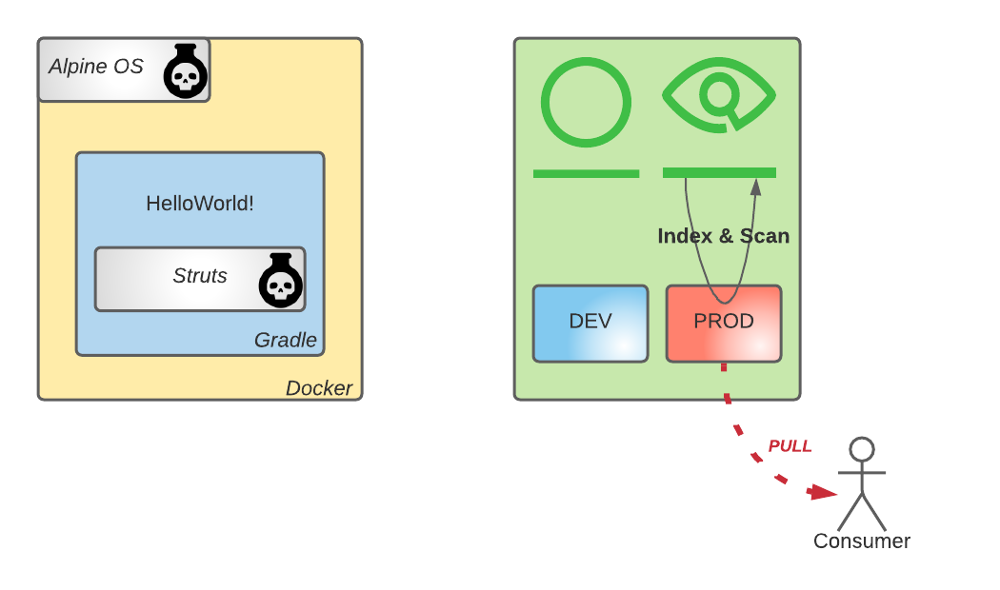

# Lab 2

## Context

- Security team is running a security audit
- You want to swiftly confirm that everything is fine security wise

## Objective



- Configure JFrog Xray
- [Try to] Download the Docker image created during Lab 1

## Index resources

- Index **devsecops-docker-prod-local** and **devsecops-gradle-prod-local** repository 
- Expedite the indexing process using the Index Now feature.

## Create Xray policy

Create security policy:
```bash
block-download-on-high-severity
```
with rule
```bash
block-download-on-high-severity-rule
```

- trigger a violation on **high severity** security issue discovered
- **Block Download** and **Block Unscanned** Artifacts as actions

## Create Xray watch

Create watch:
```bash
devsecops-docker-repo-watch
```

- add a repository as resource:
```bash
devsecops-docker-prod-local
```
- add policy:
```bash
block-download-on-high-severity
```

## Apply on existing content

## Visit the Artifact

Artifactory => Artifacts => devsecops-docker-prod-local/swampup/devsecops/0.0.9/manifest.json 

Xray message is shown: "Xray has a policy blocking this artifact for download."

## Log into Docker registry

```bash
docker login -u "${ARTIFACTORY_LOGIN}" -p "${ARTIFACTORY_API_KEY}" "${DOCKER_REGISTRY_PROD}"
```

## Download image

Remove local images:
```bash
docker rmi "${IMAGE_ABSOLUTE_NAME_DEV_LAB1}" 2>/dev/null
docker rmi "${IMAGE_ABSOLUTE_NAME_PROD_LAB1}" 2>/dev/null
```

Try to pull image from Artifactory:
```bash
docker pull "${IMAGE_ABSOLUTE_NAME_PROD_LAB1}"
```

## Conclusion

Image is blocked by Xray policy.