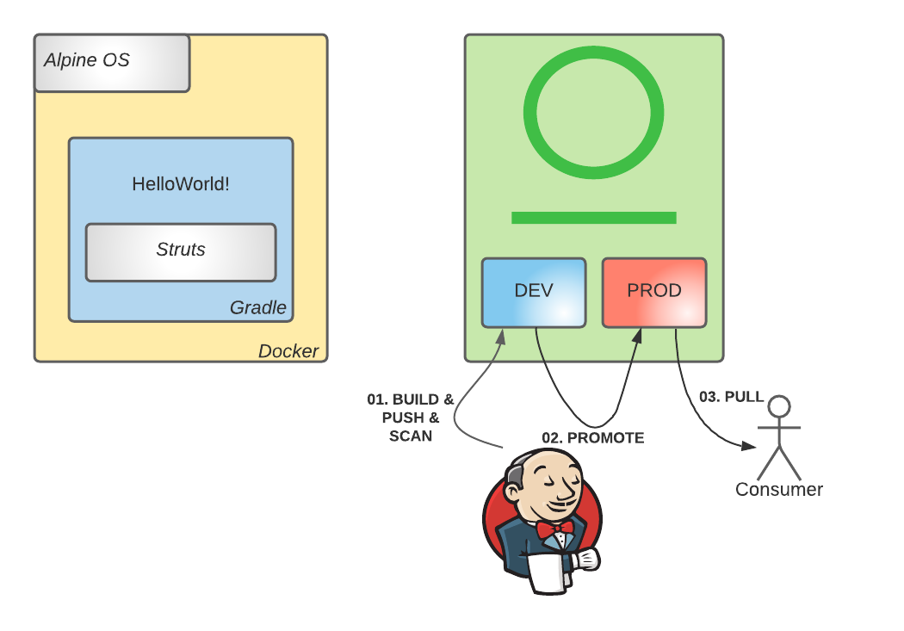

# Lab3 - CI Environemnt - Perform a build and publish it to Artifactory with Build Info metadata (Bill of Materials)

## Context

- Publishing Build Info will make sure all the information about an Artifact's inception is stored within Artifactory
- We will utilize our universal build Integration and Automation utility provided by JFrog - JFrogCLI for this purpose 

## Objective



- Build the Docker image in a CI like environment using JFrog CLI
- Upload the build information to Artifactory
- [Try to] Promote / Download the Docker image


## Configure Gradle build

```bash
jfrog rt gradle-config --server-id-resolve="${CLI_INSTANCE_ID}" --repo-resolve="${GRADLE_REPO_DEV}" --server-id-deploy="${CLI_INSTANCE_ID}" --repo-deploy="${GRADLE_REPO_DEV}" --use-wrapper=false --uses-plugin=true --deploy-ivy-desc=false
```

## Build the gradle project

```bash
printf "Building ${PROJECT_VERSION_LAB3}\nwith struts ${STRUTS_VERSION_UNSAFE} (unsafe)\n" 
```

```bash
jfrog rt gradle clean artifactoryPublish \
            -PprojectVersion="${PROJECT_VERSION_LAB3}" \
            -PartifactoryUrl="${ARTIFACTORY_URL}" \
            -PartifactoryGradleRepo="${GRADLE_REPO_DEV}" \
            -PartifactoryUser="${ARTIFACTORY_LOGIN}" \
            -PartifactoryApiKey="${ARTIFACTORY_API_KEY}" \
            -PstrutsVersion="${STRUTS_VERSION_UNSAFE}" \
            --build-name "${CLI_GRADLE_BUILD_NAME}" \
            --build-number 1
```


## Collect the environment variables
```bash
jfrog rt build-collect-env "${CLI_GRADLE_BUILD_NAME}" 1
```

## Publish Gradle Build info
```bash
jfrog rt build-publish --server-id="${CLI_INSTANCE_ID}" "${CLI_GRADLE_BUILD_NAME}" 1
```
Recording here - 
 
 

## Log into Docker registry

```bash
docker login -u "${ARTIFACTORY_LOGIN}" -p "${ARTIFACTORY_API_KEY}" "${DOCKER_REGISTRY_DEV}"
```

## Build Docker image

```bash
printf "Building ${IMAGE_ABSOLUTE_NAME_DEV_LAB3}\nwith base image ${BASE_IMAGE_UNSAFE} (unsafe)\n" 
```

```bash
docker build -t "${IMAGE_ABSOLUTE_NAME_DEV_LAB3}" --build-arg "BASE_IMAGE=${BASE_IMAGE_UNSAFE}" .
```

## Push Docker image to Artifactory

```bash
jfrog rt docker-push --server-id="${CLI_INSTANCE_ID}" --skip-login --build-name="${CLI_DOCKER_BUILD_NAME}" --build-number=1 --module="${CLI_DOCKER_BUILD_NAME}" "${IMAGE_ABSOLUTE_NAME_DEV_LAB3}" "${DOCKER_REPO_DEV}"
```

## Collect the environment variables
```bash
jfrog rt build-collect-env "${CLI_DOCKER_BUILD_NAME}" 1
```

## Publish Docker Build info

```bash
jfrog rt build-publish --server-id="${CLI_INSTANCE_ID}" "${CLI_DOCKER_BUILD_NAME}" 1
```
- Recording Docker build, publish and viewing bill of materials 
 
 
## Conclusion

Successfully, we are able to complete CI Integration 

## End of Lab 3. Below section is completely optional


# OPTIONAL (if you are ahead of others in the lab)
## Context

- Lets publish a second version of this application which has a different set of dependencie and Bill of Materials 

## Objective

- Modify the dependecy versions
- Build the Docker image in a CI like environment using JFrog CLI
- Upload the build information to Artifactory
- Promote the Docker image to a production grade repository

## Build the gradle project - build 2

```bash
printf "Building ${PROJECT_VERSION_LAB4}\nwith struts ${STRUTS_VERSION_SAFE} (safe)\n" 
```

```bash
jfrog rt gradle clean artifactoryPublish \
            -PprojectVersion="${PROJECT_VERSION_LAB4}" \
            -PartifactoryUrl="${ARTIFACTORY_URL}" \
            -PartifactoryGradleRepo="${GRADLE_REPO_DEV}" \
            -PartifactoryUser="${ARTIFACTORY_LOGIN}" \
            -PartifactoryApiKey="${ARTIFACTORY_API_KEY}" \
            -PstrutsVersion="${STRUTS_VERSION_SAFE}" \
            --build-name "${CLI_GRADLE_BUILD_NAME}" \
            --build-number 2
```

## Collect the environment variables
```bash
jfrog rt build-collect-env "${CLI_GRADLE_BUILD_NAME}" 2
```
## Publish Gradle Build info

```bash
jfrog rt build-publish --server-id="${CLI_INSTANCE_ID}" "${CLI_GRADLE_BUILD_NAME}" 2
```
- Assume that this gradle build has passed all the QA/QC tests and needs to be promoted to the next matruity level 

## Promote Gradle build to production repository

```bash
jfrog rt build-promote --server-id="${CLI_INSTANCE_ID}" "${CLI_GRADLE_BUILD_NAME}" 2 "${GRADLE_REPO_PROD}-local" 
```
## Build Docker image - Build 2 

```bash
printf "Building ${IMAGE_ABSOLUTE_NAME_DEV_LAB4}\nwith base image ${BASE_IMAGE_SAFE} (safe)\n" 
```

```bash
docker build -t "${IMAGE_ABSOLUTE_NAME_DEV_LAB4}" --build-arg "BASE_IMAGE=${BASE_IMAGE_SAFE}" . --no-cache
```

## Push Docker image to Artifactory

```bash
jfrog rt docker-push --server-id="${CLI_INSTANCE_ID}" --skip-login --build-name="${CLI_DOCKER_BUILD_NAME}" --build-number=2 --module="${CLI_DOCKER_BUILD_NAME}" "${IMAGE_ABSOLUTE_NAME_DEV_LAB4}" "${DOCKER_REPO_DEV}"
```

## Collect the environment variables
```bash
jfrog rt build-collect-env "${CLI_DOCKER_BUILD_NAME}" 2
```
## Publish Docker Build info

```bash
jfrog rt build-publish --server-id="${CLI_INSTANCE_ID}" "${CLI_DOCKER_BUILD_NAME}" 2
```

## Promote Docker image to production repository

```bash
jfrog rt build-promote --server-id="${CLI_INSTANCE_ID}" "${CLI_DOCKER_BUILD_NAME}" 2 "${DOCKER_REPO_PROD}-local" 
```

- Recording for Optional section with Diff between builds towarsds the end 


## Conclusion

- Build passed successfully
- We can access the diff between the builds to see what has changed between the builds 
